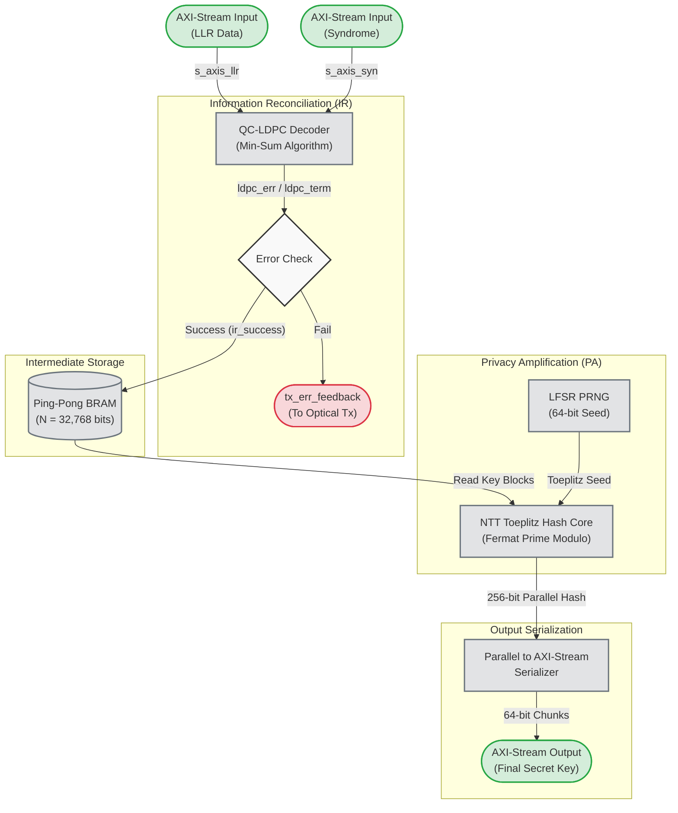

# QKD Post-Processing FPGA Pipeline (v2)

This repository contains the RTL (Verilog) implementation and the Bare-Metal C Drivers (Xilinx Vitis) of a complete Post-Processing pipeline for Quantum Key Distribution (QKD) systems. It is optimized for the Xilinx Zynq ZC702 FPGA SoC.

The system processes continuous streams of quantum key data, performing two major cryptographic stages through Hardware/Software (HW/SW) Co-Design:
1. **Information Reconciliation (IR)**: Utilizes a high-throughput QC-LDPC Decoder (WiMAX matrix) to correct quantum bit errors (QBER).
2. **Privacy Amplification (PA)**: Employs a highly optimized Number Theoretic Transform (NTT) core to hash the reconciled key via Toeplitz matrix multiplication, ensuring unconditional security.

---

## 🏗️ System Architecture

The core top-level module is `qkd_post_processing_top.v`, which orchestrates the entire data flow:
*   **Input**: AXI-Stream interfaces for LLR (Log-Likelihood Ratios) and Syndrome data.
*   **IR Stage (LDPC)**: 
    *   WiMAX QC-LDPC Mother Matrix.
    *   Supports Adaptive Code Rates (1/2, 2/3, 3/4, 5/6) through optimal puncturing.
    *   Min-Sum Belief Propagation algorithm (Max Iterations = 32).
*   **PA Stage (NTT-Toeplitz Hash)**:
    *   $N = 32,768$ bit Ping-Pong BRAM buffer.
    *   17-bit Fermat Prime Modular Arithmetic ($Ring Size = 32768$).
    *   Integrated 64-bit LFSR PRNG for dynamic Toeplitz seed generation.
*   **Output**: 256-bit secure key serialized over an AXI-Stream interface (64-bit word size).
*   **HW/SW Co-Design (Interrupts)**: `ir_fail_intr` signal to trigger the ARM Cortex-A9 processor for Software-assisted Blind Reconciliation.



---

## 🛠️ Project Structure
```text
qkd_post_processing/
├── rtl/
│   ├── ir_qc_ldpc/        # LDPC Decoder Core & Memories
│   ├── pa_ntt/            # Privacy Amplification (NTT Core, BRAM Ctrl, PRNG)
│   └── top/               # Top-level integration (qkd_post_processing_top)
├── tb/                    # Testbenches
│   └── tb_system_top.v    # Automated golden model testbench
├── python_model/          # Python algorithms for Test Vector Generation
│   └── qkd_ldpc_sim.py    # Generates LLR & Syndrome based on QBER
├── scripts/               # Vivado Tcl scripts
│   └── sync_files.tcl     # Script to sync source code into Vivado
├── vitis_src/             # Bare-Metal C Drivers for Zynq ARM PS
│   ├── main.c             # Main control flow (DMA, GPIO, Interrupts)
│   ├── generate_test_vectors.py # Python script to generate test_data.h
│   └── test_data.h        # Fake LLR/Syndrome arrays for DMA injection
└── .gitignore             # Ignores Vivado build artifacts
```

---

## 🚀 Simulation & Verification

The verification environment compares the RTL hardware output against a mathematically perfect Golden Model generated by Python.

### Step 1: Generate Test Vectors
Run the Python simulation script to generate `llr_in.txt`, `syndrome_in.txt`, and `expected_out.txt` based on your desired QBER.
```bash
cd python_model
python qkd_ldpc_sim.py
```
*(Default is Rate 1/2 with 2% QBER, which the system can successfully correct in 4 iterations).*

### Step 2: Run Vivado Simulation
Load the files into your Vivado project. Use the provided Tcl script inside the Vivado Tcl Console to automatically copy all necessary RTL files:
```tcl
source "path/to/qkd_post_processing/scripts/sync_files.tcl"
```
Launch the simulation:
```tcl
relaunch_sim
run all
```

**Expected Log Output**:
```
Loaded 144 bytes of Syndrome.
Loaded 2304 LLR elements.
Waiting for IR (LDPC) Module to complete Syndrome-based decoding...
>>> [SUCCESS] Error Reconciliation (IR) Phase Completed! Transitioning to PA...
-------------------------------------------------
DATA TEST RESULTS AFTER IR (LDPC) - SYNDROME DECODING:
Total Key Bits (Reconciled Key): 2304 bits
Remaining Error Bits: 0 bits
=> Excellent! The key is completely error-free (Matched Golden Model).
-------------------------------------------------
>>> Privacy Amplification (PA) is executing Toeplitz Hash...
System Top Simulation Complete!
```

---

## ⚙️ Synthesis & Implementation (Zynq ZC702)

This IP is fully synthesizable. To deploy it on a real board:
1. Open Vivado and create a **Block Design**.
2. Add the `qkd_post_processing_top` module as an RTL IP.
3. Instantiate a **Zynq-7000 Processing System**.
4. Connect the input/output AXI-Stream interfaces of the QKD IP to the Zynq's **AXI Direct Memory Access (DMA)** blocks.
5. Map the `ir_fail_intr` to the Zynq Processing System's `IRQ_F2P` interrupt port.
6. Generate Bitstream and export `.xsa`.

### Bare-Metal Software (Vitis)
After exporting the hardware:
1. Create a Vitis Platform Project using the `.xsa` file.
2. Create an Application Project (Empty or Hello World).
3. Copy the files from `vitis_src/` into your `src/` directory.
4. Build and Run on the physical hardware to see the 256-bit Secret Key extraction process in action via UART.
